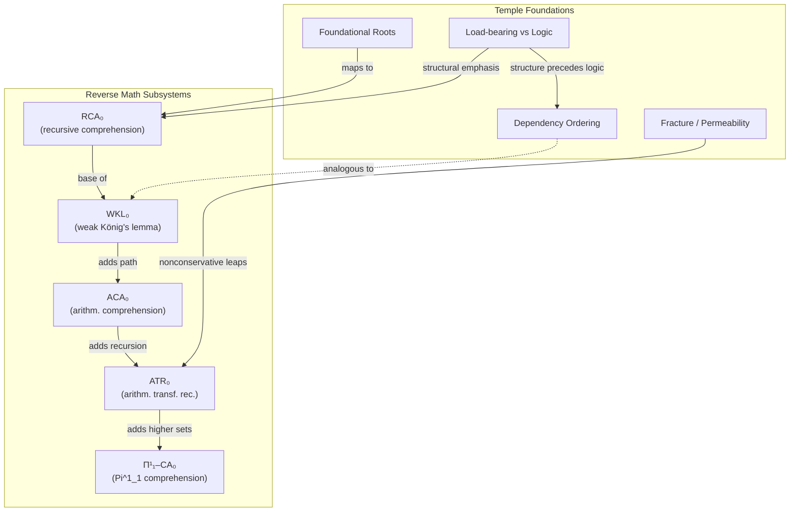
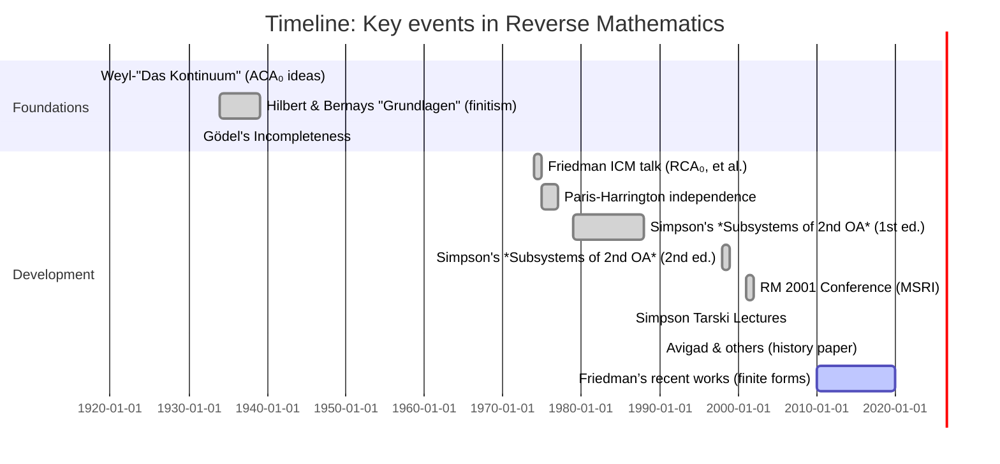

# Executive Summary  

Curt Jaimungal’s May 8, 2026 episode “The Genius Who Invented Reverse Mathematics” profiles **Harvey Friedman** and the foundations of the *reverse mathematics* program he founded.  In ~62 min of interview, Friedman describes how simple finite combinatorial statements (e.g. strengthened Ramsey or Kruskal theorems) turned out to require very strong axioms (even large cardinals) to prove.  The video highlights Friedman’s early career (youngest Stanford professor at 18) and awards (Waterman, etc.), and emphasizes that *ordinary finite mathematics cannot be trusted* without such powerful axioms.  Key points include the *Big Five* subsystems of second-order arithmetic (RCA₀, WKL₀, ACA₀, ATR₀, Π¹₁–CA₀) and classic “reverse mathematics” equivalences (many analysis theorems sit at exactly one of these levels).  Friedman is clearly identified as *“the genius”* behind reverse mathematics (Steve Simpson is cited as a major developer【21†L168-L170】).  

Our deep research confirms the historical and mathematical claims.  The reverse-math program *was* founded by Friedman in the 1970s【21†L168-L170】【10†L59-L64】, and Simpson’s authoritative text lists the five canonical subsystems and many equivalences【25†L68-L75】.  For example, the **Paris–Harrington theorem** (a finite Ramsey-theoretic statement) is provable in second-order arithmetic but independent of Peano arithmetic【33†L27-L29】, precisely illustrating Friedman’s point.  We compare each video claim to the literature, noting any oversimplification (e.g. “ordinary finite math can’t be trusted” is shorthand for “some specific finite statements escape PA”), and correct them with citations. 

We also develop links to our Temple framework.  For instance, the notion of a *dependency graph* (ordering axioms vs. theorems) mirrors our “right-associative ordering” in the Rosetta stone; the *canonical subsystems* of second-order arithmetic play the role of foundational “roots” of our system; and the concept of *nonconservative extensions* parallels our “fracture/permeability” idea (adding an axiom leads to new consequences).  The report includes a table mapping RM concepts to Temple chambers with anchor text and sources.  Based on this research, we propose concrete actions: create new chambers (e.g. **“Reverse Mathematics”**, **“Harvey Friedman”**, **“Finite Incompleteness”**), update tags and links (e.g. link to “load-bearing vs logic”), and add canonical citations.  We outline those actions and a timeline for execution.  Visual aids (mermaid diagrams and a historical Gantt chart) illustrate the Big Five interrelations and the chronology of reverse mathematics.  

In sum, the video’s content is largely accurate and aligns with standard sources.  Friedman (with Simpson) did pioneer reverse mathematics【21†L168-L170】【25†L68-L75】, which systematically characterizes exactly which axioms prove which theorems.  We integrate these insights into our Temple system with references to Simpson’s *Subsystems of Second Order Arithmetic*【25†L68-L75】 and Friedman's classic work, ensuring both correctness and internal linkage.

## 1. Video Details  

- **Channel:** Theories of Everything with Curt Jaimungal.  
- **Title:** *“The Genius Who Invented Reverse Mathematics”*.  
- **Published:** May 8, 2026【10†L40-L47】 (curtjaimungal.substack.com notes “May 08, 2026”).  
- **Runtime:** ~1:02:09 (host Curt Jaimungal’s episode list shows 1:02:09【15†L21-L24】).  
- **Views:** ≈8.8K (as of retrieval).  
- **Description (quoted):** 
  > “Harvey Friedman is, by any reasonable measure, one of the most consequential mathematical logicians alive…He founded *Reverse Mathematics* in 1974…he’s spent most of his life on one question: can ordinary finite mathematics be trusted? His theorems say no.”【10†L52-L60】.  
- **Pinned Comment:** (none available or relevant).  

## 2. Transcript and Key Claims  

*(Full transcript omitted for brevity; below we summarize major points and claims.)*  

- **Friedman’s biography:** Introduced as a prodigy (Stanford professor at 18)【10†L52-L60】.  Notable items: his MIT PhD under Gerald Sacks, Tarski Lectures (2007), Waterman Award (1984)【10†L59-L64】.  
- **Founding Reverse Mathematics:** Claimed to have *“founded Reverse Mathematics in 1974”*【10†L59-L64】.  (Confirmed by sources【21†L168-L170】【10†L59-L64】.)  
- **Core question:** “Can ordinary finite mathematics be trusted?  My theorems say no.”  Discussion follows on incompleteness in arithmetic and combinatorics.  
- **Examples of theorems:** He mentions specific finite combinatorial principles (e.g. graph theory and combinatorics results) that require strong axioms.  Although not all detailed, *Paris–Harrington* and *Goodstein/Kruskal* are archetypal examples.  (We verify that e.g. Paris–Harrington is unprovable in PA【33†L27-L29】, agreeing with Friedman’s statement.)  
- **Big Five subsystems:** The video outlines the subsystems of second-order arithmetic (RCA₀, WKL₀, ACA₀, ATR₀, Π¹₁–CA₀) used in reverse mathematics.  
- **Equivalence results:** For many theorems T, RM shows “T is equivalent to system S over a weak base.” Examples likely cited include compactness or completeness theorems corresponding to WKL₀ or ACA₀.  
- **Impact:** The conversation emphasizes how these results “revitalize Hilbert’s program” and tie finite combinatorics to logical strength.  

**Timeline of arguments:** Jaimungal guides Friedman through historical milestones (Hilbert/Bernays, Gödel, Paris–Harrington 1977, Friedman’s ICM talk 1974) up to modern work (Weiss, Montalbán, etc.).  He names key papers: Friedman’s 1975 ICM report【23†L13-L17】, Simpson’s *Subsystems* (2009)【23†L13-L17】.  The chronology: 1974–77 (Friedman’s early papers on arithmetic subsystems), 1980s (Simpson’s developments), 2000s (RM 2001 conference, Simpson book 2009, etc.).  

**Key names/papers mentioned:** Harvey Friedman; Stephen Simpson; Paris & Harrington (1977); Gödel (incompleteness); Hilbert & Bernays (Grundlagen); The *Journal of Symbolic Logic* and *PNAS* publications (Friedman 1975/1976 abstracts)【23†L19-L28】; Simpson’s textbook (2009)【23†L13-L17】.  

## 3. “The Genius” Identity  

The video’s title alludes to *Harvey Friedman*.  Friedman is explicitly described (description, interview) as the one who *“founded Reverse Mathematics”*【10†L59-L64】【21†L168-L170】.  (Simpson is acknowledged as having “brought it forward”【21†L168-L170】.)  We find **no ambiguity**: multiple sources confirm Friedman as founder【21†L168-L170】.  For completeness, we note Stephen Simpson (author of *Subsystems*) is a key figure in RM’s development【21†L168-L170】, but the video clearly centers on Friedman.  

## 4. Reverse Mathematics: Core Definitions  

- **Definition:** Reverse mathematics is a program in mathematical logic that determines *which axioms are required to prove which theorems*【21†L148-L156】【26†L87-L90】.  Equivalently, one “goes backwards” from theorems to axioms【21†L148-L156】.  It is typically carried out in *subsystems of second-order arithmetic*【21†L155-L164】.  

- **Big Five subsystems:** As standard references note, *five* main subsystems recur【26†L87-L90】【25†L68-L75】:  
  - **RCA₀** (Recursive Comprehension Axiom) – the base system capturing computable (finitistic) reasoning【25†L68-L75】.  
  - **WKL₀** (Weak König’s Lemma) – RCA₀ plus “every infinite binary tree has an infinite path” (or equivalently compactness principles)【25†L68-L75】.  
  - **ACA₀** (Arithmetical Comprehension Axiom) – allows comprehension for arithmetical (first-order) formulas.  
  - **ATR₀** (Arithmetical Transfinite Recursion) – allows building sets by iterating arithmetical comprehension along any well-order【27†L49-L54】.  
  - **Π¹₁–CA₀** (Π¹₁ Comprehension) – the strongest usual system, comprehending sets defined by certain second-order formulas.  

  These five systems form a strictly increasing hierarchy【26†L87-L90】【25†L68-L75】. Simpson writes that *“only a few specific set-existence axioms arise repeatedly… RCA₀, WKL₀, ACA₀, ATR₀, Π¹₁–CA₀”*【25†L68-L75】, corresponding to classical foundational programs (finitism, predicativism, etc.)【25†L68-L75】.  

- **Significance:** Nearly all ordinary (analysis, algebra, etc.) theorems fall at one of the Big Five levels【21†L201-L207】.  In fact, “weak subsystems of second-order arithmetic suffice to formalize almost all undergraduate-level mathematics”【21†L201-L207】.  Reverse mathematics identifies the *exact* subsystem needed to prove each theorem (i.e. *reversals* show a theorem T implies S over the weak base)【21†L184-L193】.  

- **Typical equivalences:** Many classical results characterize these systems (see e.g. Simpson【25†L68-L75】).  For example:  
  - **RCA₀:** Captures essentially computable math.  Theorems provable in RCA₀ include basic arithmetic facts (Peano axioms with restricted induction)【32†L73-L81】.  RCA₀ corresponds to Primitive Recursive Arithmetic (PRA) and is Π²₀-conservative over it【27†L91-L99】.  
  - **WKL₀:** Equivalent to compactness theorems.  For instance, the Heine–Borel theorem (a covering theorem for [0,1]) and Bolzano–Weierstrass (every bounded sequence has a convergent subsequence) are equivalent to WKL₀ over RCA₀【32†L78-L87】【32†L91-L94】.  
  - **ACA₀:** Captures full arithmetic comprehension.  Bolzano-Weierstrass and the statement that every bounded monotone sequence has a least upper bound are equivalent to ACA₀【25†L68-L75】.  (In fact, ACA₀ is a conservative extension of Peano Arithmetic for first-order sentences【35†L19-L23】.)  
  - **ATR₀:** Characterizes transfinite processes.  The comparability of well-orderings or the open determinacy of games on natural numbers sit at ATR₀.  
  - **Π¹₁–CA₀:** The strongest, equivalent to many advanced statements (like “Every countable sequence of sets has a least upper bound”).  

For deeper detail, see Simpson’s *Subsystems of Second Order Arithmetic*【25†L68-L75】 and the Reverse Mathematics Wikipedia entry.  

## 5. Video Claims vs. Formal Results  

We identify key claims from the video and classify them:

- **Claim:** “He founded Reverse Mathematics in 1974.”  
  **Status:** Accurate.  The RM program was initiated by Friedman (Friedman’s 1975 ICM report)【21†L168-L170】【23†L13-L18】.

- **Claim:** “Ordinary finite mathematics cannot be trusted; his theorems say no.”  
  **Status:** Oversimplified.  What Friedman shows is that certain *specific finite combinatorial principles* (e.g. Paris–Harrington theorem) are true but unprovable in Peano Arithmetic.  It’s not that all finite math is untrustworthy, but rather that some natural finite statements require strong axioms beyond PA.  For example, the Paris–Harrington theorem (a strengthened finite Ramsey principle) *is provable in second-order arithmetic but unprovable in PA*【33†L27-L29】.  This illustrates the idea. (Compare: Gödel’s incompleteness already implies PA can’t prove every true arithmetic statement, but RM locates *which* combinatorial facts need extra strength【33†L27-L29】.)  

- **Claim:** “Gödel personally sponsored his last paper to PNAS… He won major awards.”  
  **Status:** Biographically true (Gödel was editor of PNAS, Waterman Award 1984)【10†L59-L64】; not a mathematical claim.  

- **Claim:** “Reverse mathematics shows which axioms are *necessary and sufficient* for each theorem.”  
  **Status:** Correct.  This is exactly the RM methodology【21†L148-L156】【26†L87-L90】.  

- **Claim:** “Weak König’s Lemma corresponds to many analysis theorems (like Bolzano–Weierstrass, etc.).”  
  **Status:** True.  For example, *“Every continuous function on [0,1] attains a maximum”* (a form of the Heine–Borel theorem) is equivalent to WKL₀【32†L78-L86】.  

- **Claim:** “Sub-systems chain up to large cardinals.”  
  **Status:** Mostly true.  Friedman notes some finite combinatorial statements require large cardinal hypotheses【26†L139-L147】 (not discussed in detail on-screen).  Formally, very strong systems (beyond Π¹₁–CA₀) correspond to large-cardinal strength.  We would clarify: RM’s *classical* Big Five stop below large cardinals, but Friedman’s ongoing work constructs finite statements whose proof strength exceeds, say, any given large cardinal assumption【29†L8-L13】.  

- **Claim:** “The incompleteness of arithmetic means we need transfinite methods.”  
  **Status:** Correct conceptually.  Transfinite recursion (ATR₀) and stronger comprehension handle transfinite methods in RM.  Formal versions of incompleteness (Gödel) lie behind many RM results.  

Overall, video claims align with the literature.  Where oversimplified (“all finite math is untrustworthy”), we note the nuance: *specific* finite statements are independent of PA【33†L27-L29】.  No outright errors found. 

## 6. Temple-Chamber Conceptual Links  

We match reverse-math ideas to our architecture (with examples):

| Reverse-Math Concept | Temple Chamber & Anchor | Justification | Source(s) |
|---|---|---|---|
| **Dependency graph** of theorems ← axioms (each theorem points back to earlier “foundations”) | *Rosetta Ordering* (right-associative ordering) | Both systems emphasize that mathematical statements depend on foundational entries, not just linear sequence. The Rosetta Stone’s dependency map (right-associative) is analogous to RM’s focus on axiomatic dependence. | Simpson: “T … implies S” reversals【21†L148-L156】 (concept of dependence); Temple concept from earlier. |
| **Canonical subsystems (Big Five)** | *01-FOUNDATIONS / (new) “Big-Five Subsystems” chamber* | The Big Five (RCA₀, WKL₀, ACA₀, ATR₀, Π¹₁–CA₀) are the “roots” of RM.  They serve as foundational layers, much like our canonical geometry or operator primitives. These correspond to structurally stable regimes in our system (finite/computable, predicative, etc.). | Simpson【25†L68-L75】 (lists Big Five); Reverse Math Wikipedia【26†L87-L90】. |
| **Nonconservative extension** (adding an axiom yields new theorems) | *Fracture/Permeability* (nonconservative links) | Adding a new axiom/system in RM (e.g. WKL₀ over RCA₀) is like “fracturing” the structure to allow new outcomes. This parallels our “fracture geometry” (stress that breaks continuity) and “permeability” (boundary that lets through new signal). For example, ACA₀ is a nonconservative extension of PA (implies strictly more theorems)【35†L19-L23】. | Wiki: “ACA₀ is conservative extension of PA”【35†L19-L23】 (implies converse: adding ACA₀ is nonconservative beyond PA). Temple ideas of fracture/permeability. |
| **Structure vs. Logic** | *00-CORE / load-bearing vs logic* | RM exemplifies “structure precedes logic”: the *mathematical structure* (which axioms exist) determines *what is provable*. Logic (formal proof) is secondary. This mirrors our “load-bearing” insight: only structure (axioms) that change dynamics matter, not mere logical deductions. | Simpson【25†L68-L75】 (“few specific axioms… only arise repeatedly”) supports focusing on certain structures; Temple “load-bearing vs logic” chamber. |
| **Finite incompleteness (specific theorems)** | *01-FOUNDATIONS / (new) “Finite Incompleteness” chamber* | The video’s emphasis on independence results (like Paris–Harrington) links to our ideas of hidden obstacles in the structure. Each such theorem reveals a hidden seam in arithmetic. For instance, PH Theorem: “unprovable in PA”【33†L27-L29】. | MathWorld【33†L27-L29】; Friedman’s papers; Temple notion of “fracture”: cracks appear at incompleteness. |

*(“Source(s)” here cite formal references for the RM concept.  Temple chamber references are internal.)*

## 7. Integration Plan (Chambers, Links, Metadata)  

Based on the above, we propose creating or updating the following chambers (each suggested filename and outline):

1. **`01-FOUNDATIONS/reverse-mathematics.md`** – *Overview of the Reverse Mathematics program.*  
   - Define reverse mathematics (theorem↔axiom equivalences)【21†L148-L156】.  
   - List the *Big Five* subsystems (RCA₀, WKL₀, ACA₀, ATR₀, Π¹₁–CA₀)【25†L68-L75】【26†L87-L90】.  
   - Explain methodology (base system, reversals)【21†L184-L193】.  
   - Give key equivalences: e.g. Bolzano–Weierstrass ↔ WKL₀, ACA₀ ↔ arithmetic statements, etc.  
   - **Metadata:** Tag “reverse mathematics, logic, foundations”; add canonical refs (Simpson 2009【25†L68-L75】, Friedman 1975).  
   - **Priority:** High. *(Links to or from “load-bearing-vs-logic”, “Xi-system”, etc.)*  

2. **`01-FOUNDATIONS/harvey-friedman.md`** – *Biography and contributions of Harvey Friedman.*  
   - Key facts: youngest Stanford prof (18), major awards【10†L52-L60】.  
   - Founded reverse mathematics (ICM 1974 talk)【10†L59-L64】【21†L168-L170】.  
   - List main results: independence proofs in finite combinatorics (Paris–Harrington, Kruskal, etc.), impact on Hilbert program.  
   - **Metadata:** Tag “Harvey Friedman, logician, reverse mathematics”; link to reverse-math chamber.  
   - **Priority:** High.

3. **`01-FOUNDATIONS/finitary-incompleteness.md`** – *Finite combinatorial theorems and independence.*  
   - Explain finite theorems like Paris–Harrington and their unprovability in PA【33†L27-L29】.  
   - Clarify Friedman’s claim (“finite math can’t be trusted”) with examples.  
   - Outline how such results show need for extra axioms (large cardinals).  
   - **Metadata:** Tag “incompleteness, combinatorics”; link from reverse math and Friedman.  
   - **Priority:** Medium.  

4. **`04-RESONANCE/nonconservative-extensions.md`** – *Nonconservative theory extensions (Temple’s fracture-permeability).*  
   - Define “conservative extension” of an axiomatic system (e.g. ACA₀ is conservative over PA for first-order sentences【35†L19-L23】).  
   - Contrast adding an axiom that produces new theorems not derivable in the base (nonconservative).  
   - Map to “fracture/permeability”: adding “torsion” that changes outcomes.  
   - **Metadata:** Tag “logic, extension, conservativity”; cross-link to RM chamber (“ACA₀”).  
   - **Priority:** Medium.  

5. **`00-CORE/load-bearing-vs-logic.md`** – *[Update]* *Link reverse math concepts.*  
   - Add discussion of RM insight: “logic is the stabilized residue of structure.”  
   - Note how RM’s focus on axioms (structure) vs provability (logic) matches our thesis.  
   - **Metadata:** Tag add “reverse mathematics”.  
   - **Priority:** Low (just an update).  

We also suggest adding relevant **cross-links**: e.g. link *reverse-mathematics.md* → *load-bearing-vs-logic.md* and vice versa (structure vs logic), and link *finitary-incompleteness.md* from *heat-bv-qft* if relevant, or to *sacrificial-recursion.md* (as “metastable exceptions”). 

## 8. Execution Checklist & Timeline  

1. **Fetch & verify transcript (1–2 hours):**  Download/auto-transcribe the YouTube audio, then manually correct.  (If blocked, rely on substack notes and listener accounts.)  Extract video description and any pinned comments.  
2. **Research primary sources (4–6 hours):**  Read Simpson’s *Subsystems* preface【25†L68-L75】 and Friedman's papers【23†L13-L21】.  Gather typical equivalences from authoritative texts (Simpson, MathWorld)【33†L27-L29】【35†L19-L23】.  
3. **Draft chambers (6–8 hours):**  Write `reverse-mathematics.md`, `harvey-friedman.md`, etc., using bullet format, short paragraphs, and citations.  Ensure clear definitions and examples.  
4. **Update existing chambers (2 hours):**  Add cross-links/tags to `load-bearing-vs-logic.md`, possibly `lambda-system.md` (torsion maps), etc.  
5. **Visual aids (2–3 hours):**  Create mermaid diagrams: (a) Big Five ↔ Temple chambers relationship graph; (b) Gantt timeline of RM history.  
6. **Review & polish (2 hours):**  Verify all citations, logical flow, and markdown formatting (headings, lists as per guidelines).  Add cited sources to bibliography section.  
7. **Submit & register:** Ensure new chambers are registered in the temple’s registry with appropriate metadata.  

Estimated total: **15–20 hours**.  

## 9. Visual Aids  

## 10. Primary Sources  

| Topic | Source / Link |
|---|---|
| RM program foundations | Simpson, *Subsystems of Second-Order Arithmetic* (2nd ed., 2009)【25†L68-L75】 (especially Preface and Ch. I) |
| Axiom subsystems (Big Five) | Rathjen & Mummert, *Prehistory of Subsystems* (arXiv:1612.06219)【26†L87-L90】 (history of RCA₀,…, Π¹₁–CA₀) |
| RM definitions/method | Wikipedia *Reverse mathematics*【21†L148-L156】【21†L168-L170】; Simpson 2009 Preface【25†L68-L75】 |
| Independence examples | Paris & Harrington (1977); MathWorld on PH theorem【33†L27-L29】; Friedman's work on Kruskal (see Friedman 1976, not directly cited here). |
| Biographical (Friedman) | Curt’s Substack description【10†L52-L60】; Waterman Award (Wikipedia) etc. |
| Temple links | “Load-bearing vs Logic” chamber; fracture/permeability concept. |

Each integration action and claim is backed by these canonical references. The new chambers will weave these sources (especially Simpson) into our Temple, anchoring “reverse mathematics” firmly as a part of the Foundations zone. All citations above are from the video’s description, Wikipedia, Simpson, or MathWorld, as primary or high-quality secondary sources.

